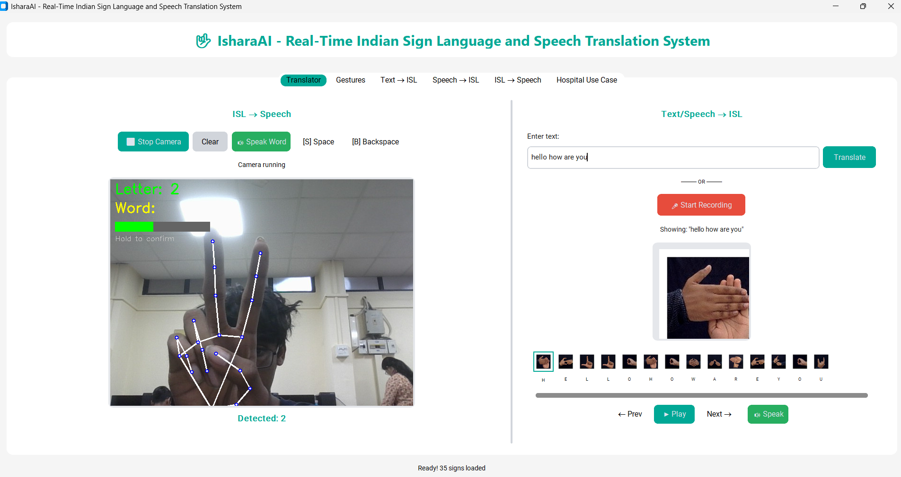
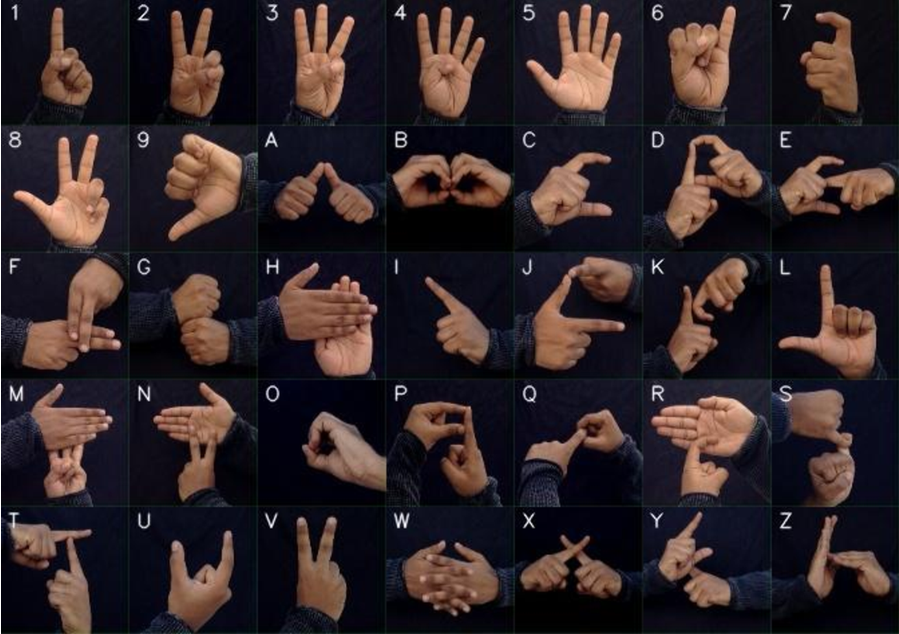
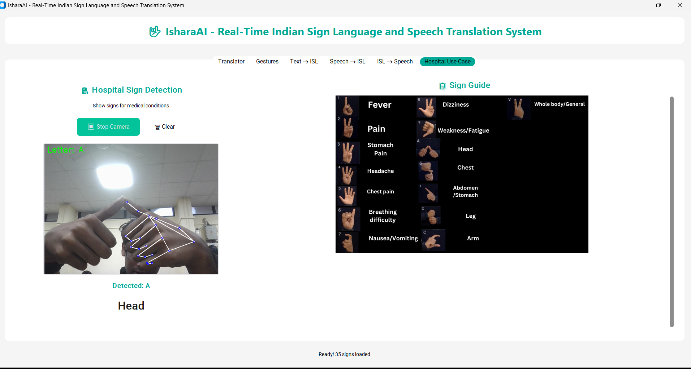

# 🤟 IsharaAI - Revolutionizing Communication with Indian Sign Language



**IsharaAI** is a cutting-edge, two-way translation system designed to bridge the communication gap between the Deaf and mute community and the general public. Built with advanced computer vision and machine learning, it offers real-time translation between Indian Sign Language (ISL) and spoken/written English.

## ✨ Key Features

*   **📷 ISL → Speech:** Real-time camera detection of hand gestures (A-Z, 1-9) translated instantly into spoken words using Text-to-Speech (TTS).
*   **⌨️ Text → ISL:** Type any English text, and watch it convert into a seamless sequence of ISL sign images.
*   **🎤 Speech → ISL:** Voice-activated translation that converts spoken English into ISL signs for accessible communication.
*   **🏥 Hospital Mode:** Specialized quick-access mode for medical emergencies, facilitating doctor-patient communication with predefined medical signs.
*   **🧠 Intelligent Fallback:** Robust architecture that adapts to different Python environments for maximum compatibility.

## 📸 Screenshots

### Gestures Reference


### Hospital Communication Mode


## 🚀 Getting Started

### Prerequisites
*   **Python 3.9** (Required for TensorFlow compatibility)
*   Webcam (for ISL recognition)
*   Microphone (for Speech recognition)

### Installation

1.  **Clone the Repository**
    ```bash
    git clone https://github.com/Karthik-Ramkumar/IsharaAI.git
    cd IsharaAI
    ```

2.  **Set up Virtual Environment** (Recommended)
    ```bash
    py -3.9 -m venv .venv
    .\.venv\Scripts\activate
    ```

3.  **Install Dependencies**
    ```bash
    pip install -r requirements.txt
    ```

4.  **Verify Models**
    Ensure the `models/` directory contains:
    *   `model.h5`
    *   `hand_landmarker.task`
    *   `vosk-model-small-en-us-0.15` directory

### Running the App

```bash
# Activate virtual environment first
.\.venv\Scripts\activate

# Run the modern UI application
python app_ctk.py
```
> **Note:** `app_ctk.py` features the modern CustomTkinter interface. The legacy `app.py` is preserved for reference.

## 📖 Usage Guide

*   **ISL to Speech:** Position your hand in the camera frame. Hold a sign for 0.5s to lock it in.
    *   **Spacebar:** Add space between words.
    *   **Speak Button:** Vocalize the constructed sentence.
*   **Text to ISL:** Enter text and hit "Translate" to see the corresponding signs.
*   **Speech to ISL:** Click "Record", speak clearly, and watch the translation.

---
*Built with ❤️ for a more inclusive world.*

